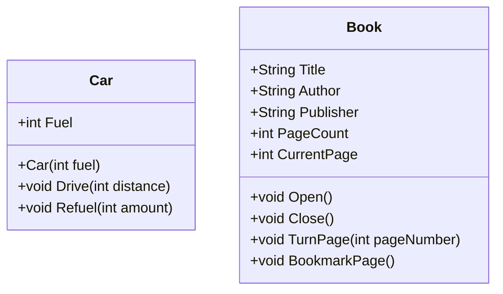
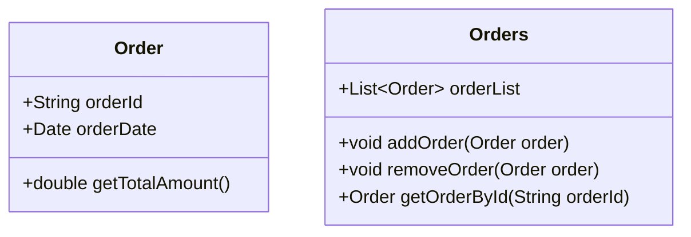
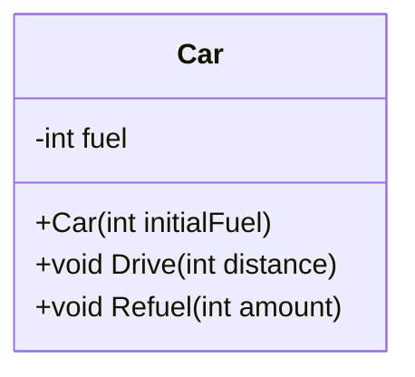
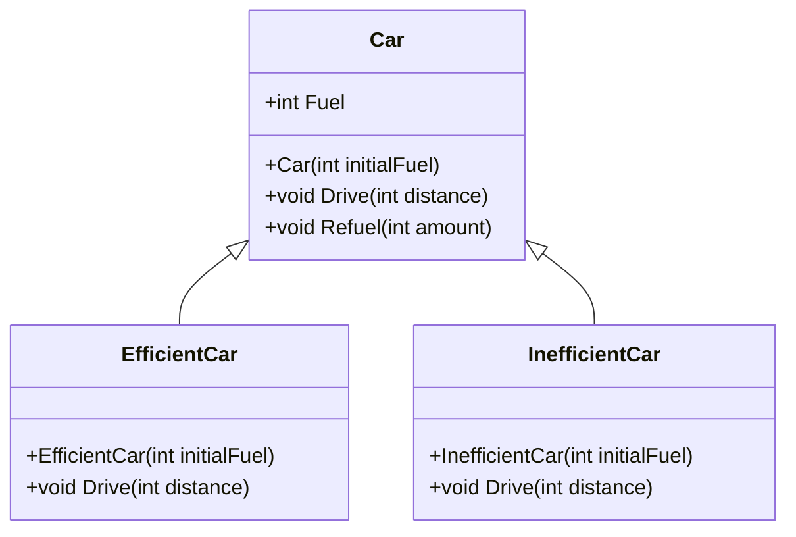
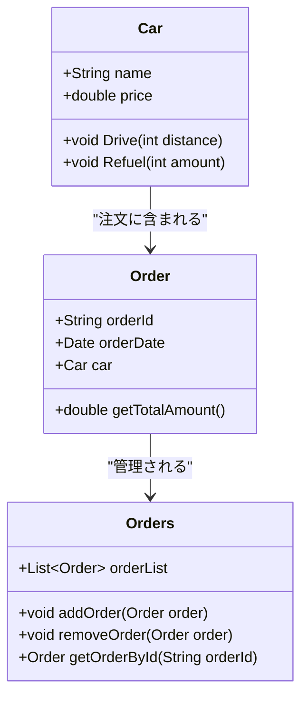
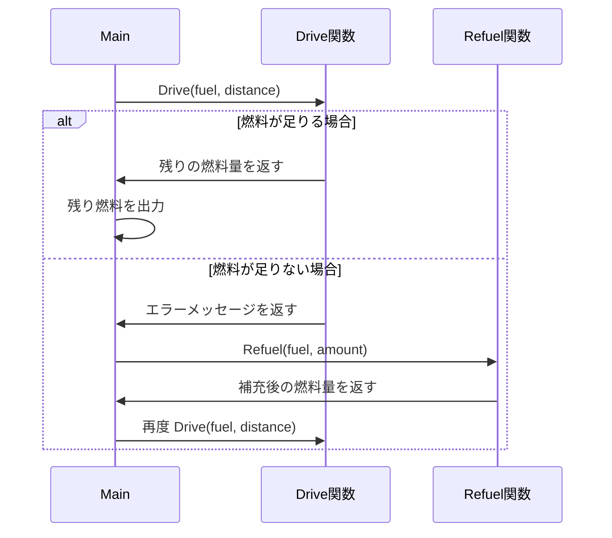
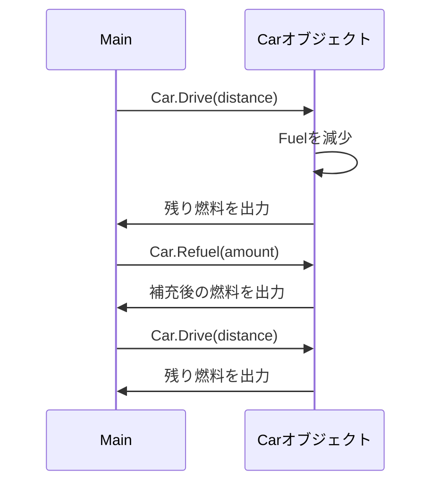

 # オブジェクト指向とは

## 定義
	ソフトウェアをオブジェクトという単位で構築する手法
	実世界のものや概念をオブジェクトとしてプログラムで表現する

 ## 基本概念
	 - オブジェクト
		あるものを表現する実態で、属性（データ）とメソッド（操作）を持つ．
		例として”車”オブジェクトが「色」や「速度」といった属性、「走る」や「止まる」といったメソッドをもつ

 
 

## 何をオブジェクト化するのか

### 1 現実のものをオブジェクト化

### 2 概念をオブジェクト化

### 3 デザインパターンにのっとったものをオブジェクト化
 - 生成に関するパターン（Creational Patterns）
 - 構造に関するパターン（Structural Patterns）
 - 振る舞いに関するパターン（Behavioral Patterns）
  
 
 

## カプセル化
### 定義
	データ(属性)とそれに対する操作(メソッド)を一つの単位(オブジェクト)にまとめ、
	外部から直接アクセスできないようにすることで、データの保護やモジュール性を高める．
### 目的
	データの保護:
	 オブジェクトの内部データが不正に変更されないように保護します。
	 必要なデータだけを外部に公開することで、プログラム全体の安定性が向上します。
	モジュール性の向上:
	 オブジェクトごとに独立したデータと操作を持たせることで、
	 コードの再利用性や保守性が高まります。

 
 

## 継承
### 定義
	親クラス（基底クラス）の属性やメソッドを、別のクラス（子クラス、派生クラス）で引き継ぐ仕組み。
	子クラスは親クラスの機能を使いながら、独自の機能を追加したり、既存の機能を上書きしたりできる。

### 目的
	コードの再利用性の向上: 共通の機能を親クラスにまとめることで、重複したコードを書く必要がなくなる。
	また、共通部分の変更が一か所で済むため、保守が容易になる。

	階層構造の設計: クラスの関係性を階層化することで、システムの構造が整理され、見通しが良くなる。
	各クラスの役割が明確になり、システムの拡張や理解が容易になる。

 
 

## ポリモーフィズム
### 定義
	ポリモーフィズム（多態性）**は、同じメソッドや操作でありながら、異なるクラスで異なる動作を実現する概念です。
	親クラスのインターフェース（メソッドやプロパティなど）を共通化し、異なる子クラスがそれぞれ固有の実装を提供できます。

### 目的
	一貫性のあるインターフェース: 親クラスやインターフェースを通して、異なるオブジェクトに対して同じ操作を行うことができ、コードの一貫性が保たれます。

	柔軟性と拡張性の向上: 新しいクラスを追加する場合でも、共通のインターフェースに従えば既存コードを変更せずに動作を拡張できます。

## 抽象化

### 定義

	抽象化（Abstraction）は、複雑なシステムから重要な部分に焦点を当て、詳細な実装を隠しながら、必要な共通機能やインターフェースのみを提供することです。
	抽象化により、プログラムの利用者は複雑な内部構造を意識せずに、シンプルな操作でオブジェクトを扱うことができます。

### 目的
	必要な情報に集中する: 具体的な実装を隠蔽し、外部から必要な機能や操作だけを利用できるようにします。これにより、コードの理解や使用が容易になります。

	拡張性と保守性の向上: 共通のインターフェースを提供することで、内部の実装を変更しても、外部に影響を与えないようにでき、拡張やメンテナンスがしやすくなります。

 
 

### 再利用性

## 手続き型とオブジェクト指向
| 特徴               | 手続き型                                         | オブジェクト指向                                   |
|--------------------|--------------------------------------------------|---------------------------------------------------|
| **データの管理**   | データと処理が分離。変数が関数に渡される。          | データと処理がクラス内で一体化し、メソッドで操作。 |
| **再利用性**       | 再利用が難しい。関数ごとにデータの受け渡しが必要。   | クラスとして再利用が容易。インスタンスでデータ管理。|
| **保守性**         | データの管理が分散し、変更が他の部分に影響する可能性が高い。 | カプセル化により、変更が他に影響しにくい。        |
| **拡張性**         | 関数の追加は可能だが、データの追加が複雑になりがち。 | クラスに新しいメソッドやプロパティを追加して拡張可能。|
| **直感性**         | 処理が分かりやすいが、複雑なデータ操作が難しい。      | 実世界の概念に近い構造で、直感的に理解しやすい。   |

 
 

### 手続き型

 
 

### オブジェクト指向
